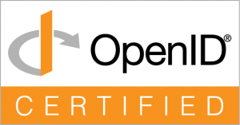

# OID4VCgo

[](https://github.com/IDFoundry/OID4VCgo/releases/latest)
[](https://github.com/IDFoundry/OID4VCgo/actions/workflows/ci.yml)
[](https://github.com/IDFoundry/OID4VCgo/actions/workflows/oid4vci-conformance.yml)
[](https://github.com/IDFoundry/OID4VCgo/actions/workflows/oid4vp-conformance.yml)
[](https://pkg.go.dev/github.com/idfoundry/oid4vcgo)
[](LICENSE)

[](https://sonarcloud.io/summary/new_code?id=IDFoundry_OID4VCgo)
[](https://sonarcloud.io/summary/new_code?id=IDFoundry_OID4VCgo)
[](https://sonarcloud.io/summary/new_code?id=IDFoundry_OID4VCgo)
[](https://sonarcloud.io/summary/new_code?id=IDFoundry_OID4VCgo)
[](https://sonarcloud.io/summary/new_code?id=IDFoundry_OID4VCgo)
[](https://sonarcloud.io/summary/new_code?id=IDFoundry_OID4VCgo)
[](https://sonarcloud.io/summary/new_code?id=IDFoundry_OID4VCgo)
[](https://sonarcloud.io/summary/new_code?id=IDFoundry_OID4VCgo)
[](https://sonarcloud.io/summary/new_code?id=IDFoundry_OID4VCgo)

**OpenID Certified™ OpenID4VCI 1.0 + OpenID4VP 1.0, under the HAIP 1.0 profile, for Go.**

OID4VCgo is a sister library to [FAPIgo](https://github.com/IDFoundry/FAPIgo),
targeting the full [OpenID4VC High Assurance Interoperability Profile
(HAIP) 1.0][haip] — the OpenID Foundation's interoperability profile for
digital credential issuance and presentation where a high level of
security and privacy is required (e.g. mobile driving licences and other
government-grade digital identity credentials). HAIP profiles two base
specifications — [OpenID for Verifiable Credential Issuance 1.0][oid4vci]
and [OpenID for Verifiable Presentations 1.0][oid4vp] — and requires
compliance with the applicable provisions of FAPI 2.0 Security Profile
Final, the same security profile FAPIgo implements and is OpenID
Certified™ against.

This isn't a generic, profile-agnostic OID4VCI/OID4VP implementation
with HAIP as an optional layer on top: HAIP's overrides — DPoP
mandatory, Wallet Attestation in place of `private_key_jwt`/mTLS, HAIP's
own algorithm requirements — are unconditional in the `issuer`/`wallet`/
`verifier` packages themselves. See ARCHITECTURE.md's "Relationship to
FAPIgo" section for the specific list.

[](https://openid.net/certification/)

> **OpenID Certified™** by Oscar Sanderson for all four HAIP roles, as
> tested for OID4VCgo 0.12.0:
> [OID4VCI 1.0 + HAIP 1.0][cert-vci] Issuer and Wallet, and
> [OID4VP 1.0 + HAIP 1.0][cert-vp] Verifier and Wallet, each for both
> SD-JWT VC and mdoc credentials. This is a result submitted to and
> published by the OpenID Foundation, not merely a self-run pass against
> the live suite. It is a statement of tested conformance, not an OIDF
> endorsement of OID4VCgo generally. See
> [conformance/README.md#oidf-certification](conformance/README.md#oidf-certification)
> for every certified profile.

> **⚠ Pre-1.0, APIs may still change.** Every role package — `issuer`,
> `wallet`, `verifier`, `credential/sdjwtvc`, `credential/mdoc`,
> `statuslist`, `attestation`, `dcql`, `oid4vpmdoc`, `haip`, `storage` —
> is implemented and tested. All four roles were OpenID Certified as
> 0.12.0 (see above), and every later release is checked against the
> same OIDF test plans by the daily conformance workflows.
> See [ARCHITECTURE.md](ARCHITECTURE.md) for the full package-by-package
> status and what, if anything, remains.

See [SPECIFICATIONS.md](SPECIFICATIONS.md) for the exact specification and
Internet-Draft versions this project targets — every one of them was
verified against the spec's own published/status text and, for drafts,
the exact `draft-…-NN` a Final OIDF spec pins, rather than assumed.

```
go get github.com/idfoundry/oid4vcgo
```

*(Go module paths are lowercased; the GitHub repository itself is
[IDFoundry/OID4VCgo](https://github.com/IDFoundry/OID4VCgo).)*

## Usage

Each role package's own doc comment (`go doc github.com/idfoundry/oid4vcgo/issuer`,
`.../wallet`, `.../verifier`, or [pkg.go.dev][pkgdev]) is the primary
API reference — it documents what's implemented, what's deliberately
out of scope, and the boundary with `fapigo/server`/`fapigo/client` for
everything OAuth 2.0/FAPI 2.0-level. Runnable `Example` functions (e.g.
`wallet.ExampleWallet_FetchAuthorizationRequest`) cover specific gaps
between packages — like fetching a Verifier's `request_uri` before
handing it to `wallet.ParseAuthorizationRequest` — that aren't obvious
from either package's own doc comment alone; `go test` runs and checks
these automatically, so they can't silently drift from the real API.

Where to start, by role:

- **Verifier** — `verifier.Transactions` runs a presentation session
  end to end (request object, `direct_post.jwt` response, same-device
  `response_code` bound to the browser), with its `RequestObjectHandler`
  and `ResponseHandler` as ready `http.Handler`s over a
  `verifier.TransactionStore` (`storage.NewVerifierTransactionStore`
  for development). `VerifiedCredential.StatusListRef` plus
  `statuslist.Checker` check revocation.
- **Wallet** — `wallet.EncryptionFromMetadata` picks credential
  request/response encryption from the Issuer's metadata;
  `wallet.Respond` answers a verified Authorization Request in one call
  (after showing the holder `wallet.PreviewPresentation`).
- **Issuer** — `issuer.CredentialHandler` serves the Credential
  Endpoint (with `issuer/fapiresource` checking access tokens), asking
  you only what to issue; `issuer.NewError` builds an OID4VCI error
  response (e.g. `credential_request_denied`); `statuslist.Publisher`
  serves a signed Status List Token.
- **Your own stores and resolvers** — `issuer/issuertest` and
  `verifier/verifiertest` hold contract tests to run against them.

For a complete, real integration, see the four `cmd/conformance-*`
binaries under `conformance/`: each pairs this library's own role
package (`issuer`, `wallet`, `verifier`) with real HTTP and, where
applicable, a real `fapigo/server`/`fapigo/client`, and each is the
binary that produced its role's OIDF certification results (see
[ARCHITECTURE.md](ARCHITECTURE.md) and each binary's own
`conformance/<role>/README.md` for what was verified). They're a
better model for a real deployment's wiring than the package tests
alone, which exercise each function in isolation rather than a full
request/response cycle over the network. For an end-to-end application
— a gmrtd passport turned into both credential formats, a browser and a
command-line wallet, and a verifier with revocation — see
[`examples/passport-vdc`](examples/passport-vdc).

[pkgdev]: https://pkg.go.dev/github.com/idfoundry/oid4vcgo

## Relevant specifications

- [OpenID for Verifiable Credential Issuance 1.0][oid4vci]
- [OpenID for Verifiable Presentations 1.0][oid4vp]
- [OpenID4VC High Assurance Interoperability Profile 1.0][haip]
- [FAPI 2.0 Security Profile][fapi2]

See [SPECIFICATIONS.md](SPECIFICATIONS.md) for the complete list,
including the pinned credential-format, attestation, and status-list
Internet-Drafts.

[oid4vci]: https://openid.net/specs/openid-4-verifiable-credential-issuance-1_0.html
[oid4vp]: https://openid.net/specs/openid-4-verifiable-presentations-1_0.html
[haip]: https://openid.net/specs/openid4vc-high-assurance-interoperability-profile-1_0.html
[fapi2]: https://openid.net/specs/fapi-security-profile-2_0.html
[cert-vci]: https://openid.net/certification/certified-oid4vci-haip-final/
[cert-vp]: https://openid.net/certification/certified-oid4vp-haip-final/

## Contributing

See [CONTRIBUTING.md](CONTRIBUTING.md) for the conformance-first
development philosophy and pre-PR checklist, and
[SECURITY.md](SECURITY.md) to report a vulnerability.

## License

MIT — see [LICENSE](LICENSE).

OpenID®, OpenID Connect™, and OpenID Certified™ are trademarks or
registered trademarks of the OpenID Foundation in the United States and
other countries. Use of these marks here is limited to the certified
conformance statement above, per [Section 3(d) of the OpenID
Certification Terms and
Conditions](https://openid.net/wordpress-content/uploads/2015/03/OpenID-Certification-Terms-and-Conditions.pdf).
